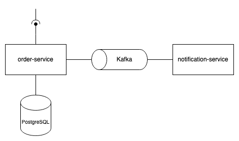

# Notification Service

## Purpose of the Service
This service is a part of an example project. Its primary purpose is to consume events from an Apache Kafka topic, which are produced by the order-service. This implementation was created to gain insights into Kafka functionality.

## Requirements
- An installed and running Apache Kafka instance is necessary.

## Architecture
The order-service retrieves sample orders via HTTP requests and stores them in the database. Additionally, an event is published to a topic, which is then consumed by the notification-service.

## How to Run the Service Locally
You can run the service locally by following these steps:
1. Execute the main method in the `hm.edu.notification.service.Main` class from your IDE in debug mode or start the service via Maven: `mvn spring-boot:run`.
2. Ensure that the order-service is also running to consume events.